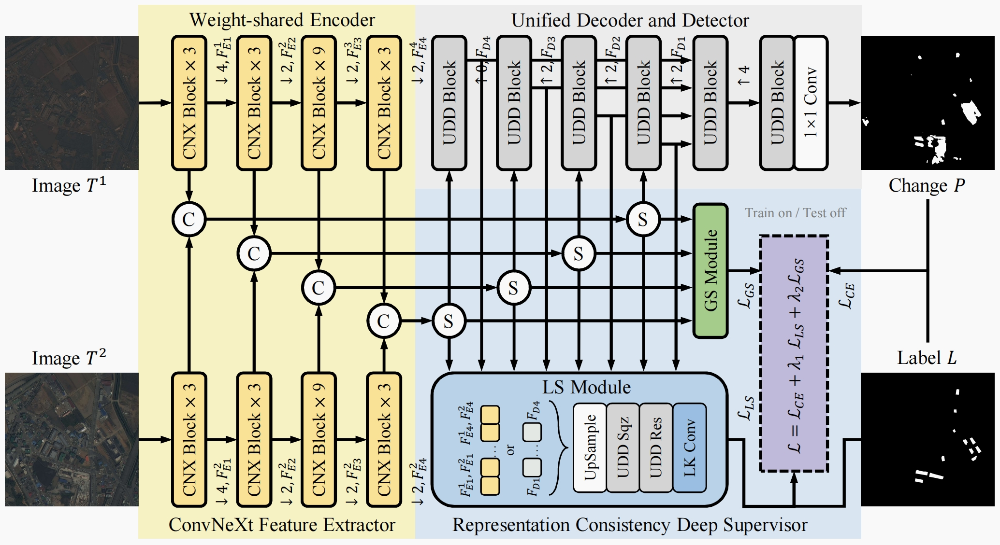
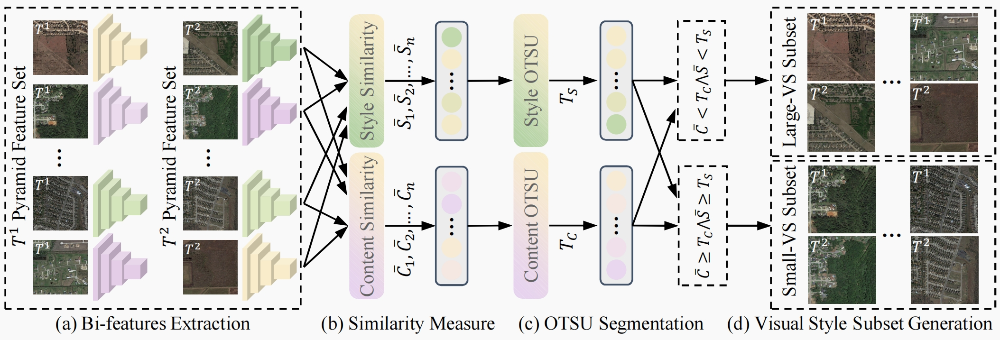

## Cross Visual Style Change Detection for Remote Sensing Images via Representation Consistency Deep Supervised Learning
Official Implemention for "Cross Visual Style Change Detection for Remote Sensing Images via Representation Consistency Deep Supervised Learning"
* The RCCD framework:  


<!--   -->

* Workflow for generating Large- and Small-VS (Visual Style) subsets based on visual style
differences.:  

<!--  {:width:"100px"} -->



Large visual style subset results within LEVIR-CD+:
```
data/src
    ┣━LEVIR-CD+_GlobalDissimilarAndLocalDissimilarSet_56.txt
    ┣━LEVIR-CD+_GlobalDissimilarAndLocalSimilarSet_17.txt
    ┣━LEVIR-CD+_GlobalDissimilarSet_73.txt
    ┣━LEVIR-CD+_GlobalSimilarAndLocalDissimilarSet_49.txt
    ┣━LEVIR-CD+_GlobalSimilarAndLocalSimilarSet_226.txt
    ┗━LEVIR-CD+_LocalDissimilarSet_105.txt
```


### Requirements


1. Python >= 3.10
2. [PyTorch](https://pytorch.org/get-started/locally/) >= 2.1
3. torchvision
4. numpy
5. opencv-python
6. matplotlib
7. tqdm
8. prettytable
9. pillow

---
### Usage

### 0. Data Preparation
All image data are sliced to 256×256 pixels. The datasets are placed in the "datasets" folder and organized as follows:
```
data/datasets
    ┣━LEVIR-CD+
    ┃    ┣━train
    ┃    ┃    ┣━T1
    ┃    ┃    ┣━T2
    ┃    ┃    ┗━label
    ┃    ┣━val
    ┃    ┃    ┣━T1
    ┃    ┃    ┣━T2
    ┃    ┃    ┗━label
    ┃    ┗━test
    ┃         ┣━T1
    ┃         ┣━T2
    ┃         ┗━label
    ┣━S2Looking
    ┃    ┗━...
    ┣━SYSU-CD
    ┃    ┗━...
    ┗━...
```

### 1. Training
In the *train.py* file, you can set the variable *backboneName* to use another backbone network in config file (such as *LEVIR-CD+_backbone-tiny.json*):  
```python
backboneName = "tiny" #'tiny','small','base','resnet18'
```  

train CDNeXt model like this:
>   python train.py -c data/configs/LEVIR-CD+_backbone-tiny.json


### 2. eval.py
In the *eval.py* file, you can set the variable *model_path* to use trained model, run eval process like this:  
>   python eval.py -c data/configs/LEVIR-CD+_backbone-tiny.json

<!-- ### Experiments

Performance changes of the main metrics during the training process. LEVIR-CD+ results and S2Looking results, respectively.
<table rules="none" align="center">
	<tr>
		<td>
			<center>
				
				<br/>
				<font color="">LEVIR-CD+ results</font>
			</center>
		</td>
		<td>
			<center>
				
				<br/>
				<font color="">S2Looking resultsg</font>
			</center>
		</td>
	</tr>
</table> -->